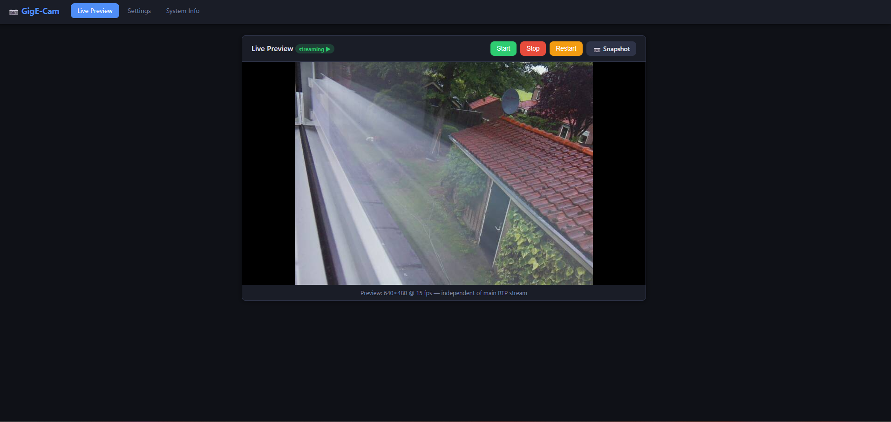
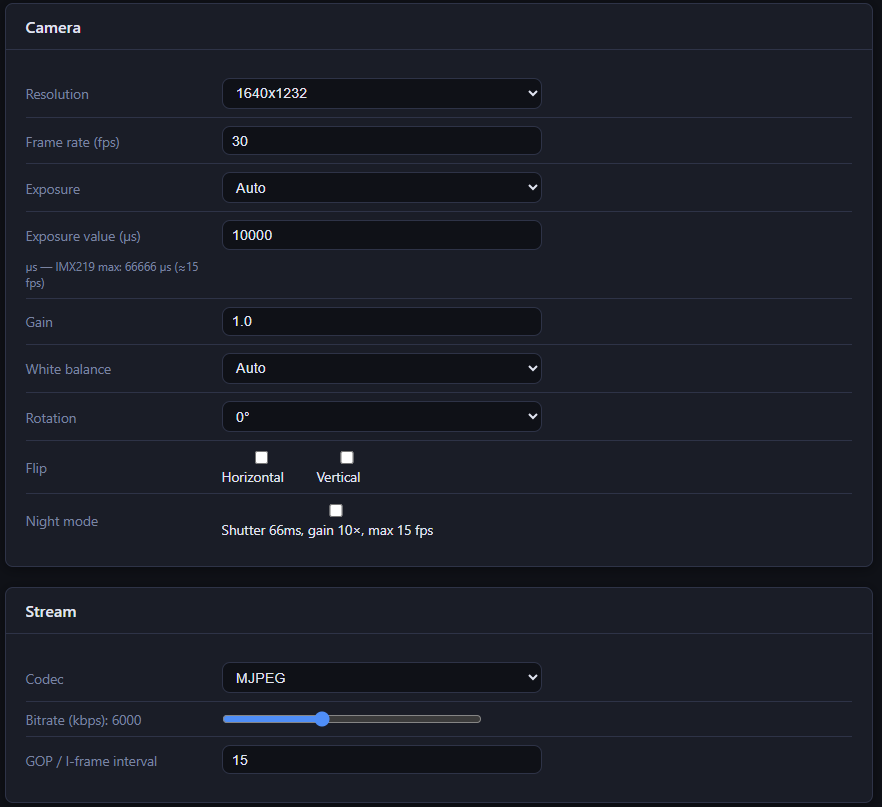
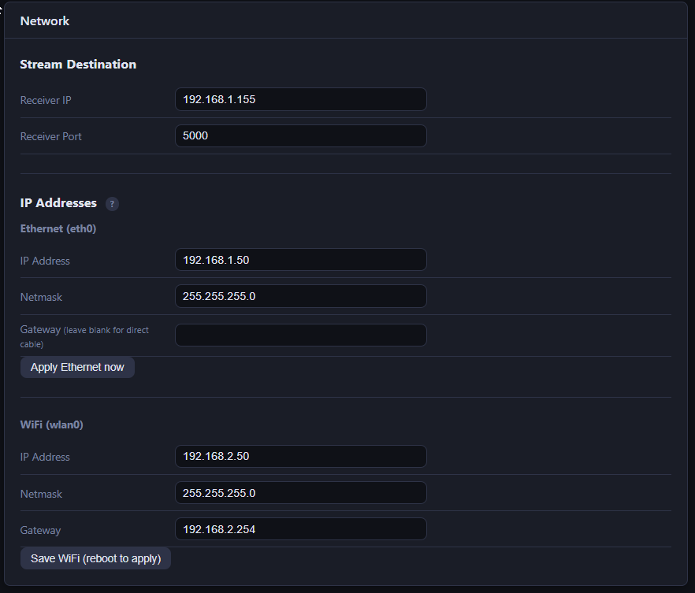
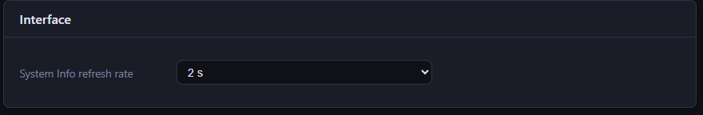
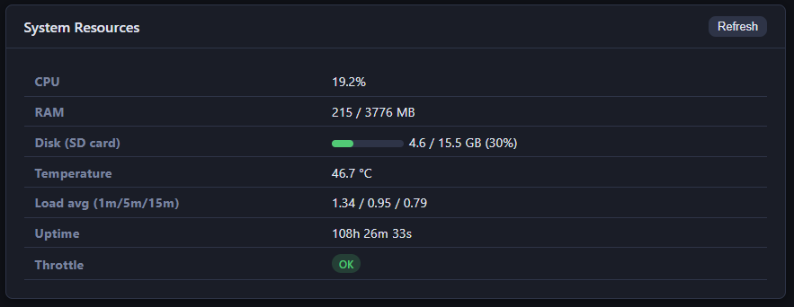
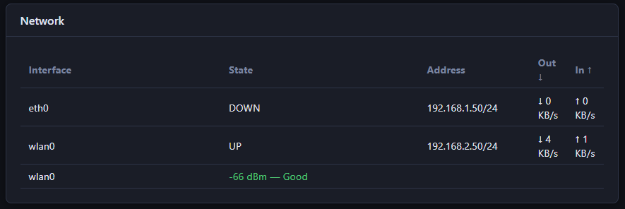
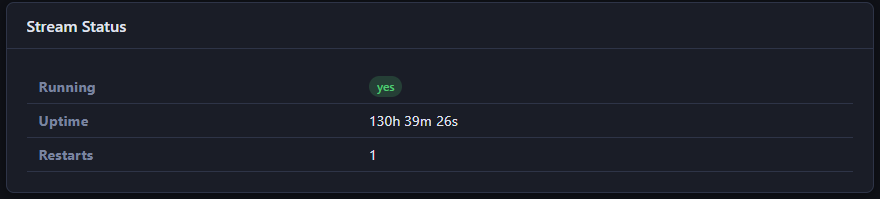
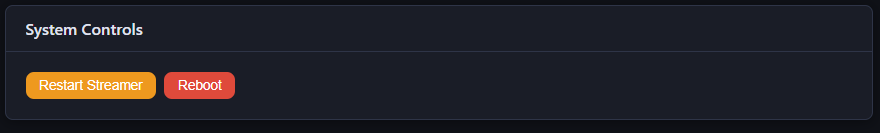

# GigE-Cam

A low-latency network camera built on a **Raspberry Pi 4** with the **IMX219 (Pi Camera v2.1)** sensor. The Pi streams H.264 over RTP/UDP to any GStreamer-capable receiver while simultaneously serving a password-protected web UI for live preview and configuration — no SSH required after first setup.

---

## Features

- **H.264 / RTP / UDP** main stream — low-latency, compatible with GStreamer, VLC, ffplay
- **MJPEG live preview** in the browser — independent 640×480 @ 5 fps stream, always on
- **Dark responsive web UI** — tabs for Live Preview, Settings, and System Info
- **Night mode** — locks sensor to maximum shutter (66 ms) and gain (10×), auto-caps to 15 fps
- **Full camera control** — resolution, frame rate, manual/auto exposure, gain, white balance, flip/rotate
- **Stream control** — start, stop, restart without touching SSH
- **Snapshot** — grab a JPEG from the live stream and download it
- **Config export / import / reset** — backup or restore settings as JSON
- **Forced password change** on first login (default: `admin` / `admin`)
- **Session cookies** — browser only asks for Basic Auth once per 24 hours
- **Pipeline watchdog** — auto-restarts GStreamer if it crashes unexpectedly
- **Atomic config writes** — power-loss-safe `write → fsync → rename` pattern
- **Rich system metrics** — CPU %, RAM, disk usage, temperature, load average, per-interface RX/TX bandwidth, WiFi signal strength, throttle status
- **Configurable System Info refresh** — 1 / 2 / 5 / 10 / 30 s, set in the Settings tab
- **Network IP management** — change Ethernet and WiFi addresses from the Settings tab; Ethernet applied live, WiFi on next reboot
- **Persistent logs** — rotating file logs in `/data/logs/` survive reboots; systemd journal also persisted to disk
- Two independent `systemd` services — web UI stays up even if the stream crashes; both use `Restart=always`

---

## Hardware

| Component | Details |
|---|---|
| Compute | Raspberry Pi 4 Model B (any RAM) |
| Camera | IMX219 — Pi Camera Module v2.1 or Arducam IMX219 |
| Storage | microSD (8 GB+) |
| Network | Ethernet (for deployment) or WiFi (for provisioning) |

**Ribbon cable orientation (Pi 4):**
- Pi side: silver contacts toward the HDMI ports
- Camera side: silver contacts toward the PCB (face down)
- Use the **CAMERA** port (between the two HDMI ports), not the DISPLAY port

---

## Architecture

```
┌─────────────────────────────────────────────────┐
│  Raspberry Pi 4                                 │
│                                                 │
│  ┌──────────────┐                               │
│  │ camera_mgr   │── GStreamer tee ──┬─────────▶ UDP :5000  (H.264/RTP)
│  │   (Python)   │                  └─────────▶ TCP :8765  (MJPEG preview)
│  │              │                               │
│  │  ZMQ REP     │◀── tcp://127.0.0.1:5555       │
│  └──────┬───────┘                               │
│         │ ZeroMQ REQ/REP                        │
│  ┌──────▼───────┐                               │
│  │   web_ui     │──── HTTP :8080 ────────────▶ browser
│  │  (FastAPI)   │                               │
│  └──────────────┘                               │
│         │                                       │
│  /data/config/settings.json  (atomic R/W)       │
└─────────────────────────────────────────────────┘
```

The two processes are independent: restarting the stream never interrupts the web UI, and a web UI crash never stops the video feed.

---

## OS Requirements

- **Raspberry Pi OS Bookworm (64-bit)** or **DietPi v10+ (ARMv8 Bookworm)**
- Headless is fine — no desktop needed

> **DietPi note:** Do **not** set `AUTO_SETUP_HEADLESS=1` — it disables the GPU/VPU and breaks the camera pipeline.

---

## Installation

### 1. System packages

```bash
sudo apt update && sudo apt install -y \
  rpicam-apps \
  python3 python3-pip python3-venv \
  python3-libcamera \
  gstreamer1.0-tools \
  gstreamer1.0-plugins-base \
  gstreamer1.0-plugins-good \
  gstreamer1.0-plugins-bad \
  gstreamer1.0-libcamera \
  v4l-utils i2c-tools
```

### 2. Project layout

```bash
sudo mkdir -p /opt/camstreamer/{app,bin}
sudo mkdir -p /data/config /data/logs
```

Copy the repository contents into `/opt/camstreamer/`:

```bash
sudo cp -r app/ /opt/camstreamer/
```

### 3. Python virtual environment

```bash
python3 -m venv /opt/camstreamer/venv
/opt/camstreamer/venv/bin/pip install -r requirements.txt
```

### 4. Default config

```bash
sudo cp config/settings.default.json /data/config/settings.json
```

Edit `/data/config/settings.json` and set `receiver_ip` to your receiver's IP address.

### 5. Enable persistent journal (optional but recommended)

```bash
sudo mkdir -p /var/log/journal
sudo sed -i 's/#Storage=auto/Storage=persistent/' /etc/systemd/journald.conf
sudo systemctl restart systemd-journald
```

This ensures logs survive reboots so you can diagnose issues after a crash or power loss.

### 6. Systemd services

```bash
sudo cp systemd/camstreamer-cam.service /etc/systemd/system/
sudo cp systemd/camstreamer-web.service /etc/systemd/system/
sudo systemctl daemon-reload
sudo systemctl enable --now camstreamer-cam camstreamer-web
```

### 7. Boot config (`/boot/firmware/config.txt`)

Add or verify these lines:

```ini
camera_auto_detect=1
dtparam=i2c_arm=on
gpu_mem=128
dtoverlay=disable-bt
disable_splash=1
boot_delay=0
```

---

## Verify camera detection

```bash
rpicam-hello --list-cameras
# Expected: "0 : imx219 [3280x2464 10-bit]"

i2cdetect -y 10
# Expected: "10: UU" (UU = driver bound, not broken)
```

> `vcgencmd get_camera` shows `supported=0 detected=0` on libcamera systems — this is **not** an error. Use `rpicam-hello --list-cameras` instead.

---

## Web UI

Browse to `http://<device-ip>:8080`

Default credentials: **admin** / **admin** — you will be forced to set a new password on first login.

| Tab | Contents |
|---|---|
| **Live Preview** | MJPEG stream (640×480 @ 5 fps) · Start / Stop / Restart buttons · Snapshot download |
| **Settings** | Camera (resolution, frame rate, exposure, gain, white balance, flip/rotate, night mode) · Stream (codec, bitrate, GOP) · Network (stream receiver IP/port, device Ethernet/WiFi addresses) · Interface (System Info refresh rate) |
| **System Info** | CPU %, RAM, disk, temperature, load average, uptime, throttle status · per-interface RX/TX bandwidth · WiFi signal · stream status (running/uptime/restarts) · live journal log tail · Restart Streamer / Reboot buttons |

### Screenshots

#### Navigation


#### Live Preview



#### Settings

| Camera & Stream | Network |
|---|---|
|  |  |

| Interface (refresh rate) | Actions |
|---|---|
|  |  |

#### System Info

| System Resources | Network Status |
|---|---|
|  |  |

| Stream Status | System Controls |
|---|---|
|  |  |

---

## Receiving the stream

### GStreamer (Linux / Windows / macOS)

```bash
gst-launch-1.0 -v \
  udpsrc port=5000 \
  caps="application/x-rtp,media=video,clock-rate=90000,encoding-name=H264,payload=96" ! \
  rtpjitterbuffer latency=50 ! \
  rtph264depay ! avdec_h264 ! autovideosink sync=false
```

### VLC (Not tested)

```
Media → Open Network Stream → rtp://@:5000
```

### ffplay (Not tested)

```bash
ffplay -protocol_whitelist file,udp,rtp -i rtp.sdp
```

where `rtp.sdp` contains:
```
v=0
m=video 5000 RTP/AVP 96
c=IN IP4 0.0.0.0
a=rtpmap:96 H264/90000
```

---

## Camera settings reference (IMX219)

| Setting | Range | Notes |
|---|---|---|
| Resolution | 640×480, 1280×720, 1640×1232, 1920×1080 | 1640×1232 = full sensor FOV (4:3) |
| Frame rate | 1–30 fps (30 fps max at ≤1920×1080) | Night mode auto-caps at 15 fps |
| Shutter (manual) | 100–66 666 µs | 66 666 µs = ~15 fps max |
| Analogue gain | 1.0–10.8× | Above ~10× noise becomes severe |
| White balance | auto, incandescent, tungsten, fluorescent, indoor, daylight, cloudy | |
| Night mode | off / on | Sets shutter=66 666 µs, gain=10×, disables AE/AGC |

> **3280×2464 is not supported for streaming.** That mode outputs raw Bayer data only and cannot be encoded in real time on the Pi 4 ISP.

---

## GStreamer pipeline (reference)

The pipeline run by `camera_mgr.py` (normal mode):

```
libcamerasrc
  → video/x-raw,WxH,fps
  → tee name=t
      t. → queue(leaky) → videoconvert → v4l2h264enc → h264parse → rtph264pay → udpsink :5000
      t. → queue(leaky) → videorate(5fps) → videoconvert → videoscale → jpegenc → multipartmux → tcpserversink :8765
```

Night mode prepends `ae-enable=false exposure-time=66666 analogue-gain=10.0` to `libcamerasrc`.

---

## Project structure

```
/opt/camstreamer/
├── app/
│   ├── camera_mgr.py      # GStreamer pipeline manager + ZMQ server + watchdog
│   ├── config.py          # Atomic settings load/save, password hashing
│   ├── web_ui.py          # FastAPI routes, auth, MJPEG proxy, REST API
│   ├── static/
│   │   ├── style.css      # Dark theme, responsive
│   │   └── app.js         # Toast notifications
│   └── templates/
│       ├── base.html
│       ├── live.html
│       ├── settings.html
│       ├── system.html
│       └── change_password.html
├── systemd/
│   ├── camstreamer-cam.service
│   └── camstreamer-web.service
├── config/
│   └── settings.default.json
└── requirements.txt

/data/
├── config/
│   └── settings.json      # Live config (not in repo — contains password hash)
└── logs/
    ├── camstreamer-cam.log  # Rotating log — camera manager (1 MB × 3)
    └── camstreamer-web.log  # Rotating log — web UI (1 MB × 3)
```

---

## Python dependencies

| Package | Version | Purpose |
|---|---|---|
| fastapi | 0.136.1 | Web framework |
| uvicorn[standard] | 0.46.0 | ASGI server |
| starlette | 1.0.0 | ASGI toolkit (pulled by FastAPI) |
| jinja2 | 3.1.6 | HTML templates |
| pyzmq | 27.1.0 | IPC between camera_mgr and web_ui |
| python-multipart | 0.0.27 | Form data parsing |

---

## Known limitations

- **No IR filter removal** — low-light performance is limited without a NoIR camera module
- **No HDR** — HDR (`--hdr sensor`) requires Camera Module 3, not supported on IMX219
- **Single user** — one shared `admin` account; no multi-user support
- **HTTP only** — no HTTPS; suitable for trusted LAN, not public internet
- **No persistent /data partition** — a future phase will add an F2FS data partition with overlay root for power-loss resilience

---

## Roadmap

- [x] Boot time: 5–10 seconds — achieved (~6 s from power-on to first frame)
- [x] Ethernet static IP — `eth0` configured at `192.168.1.50`; WiFi retained for management
- [ ] Disable WiFi in deployment (Ethernet-only mode)
- [ ] Read-only root filesystem + persistent `/data` partition (F2FS)
- [ ] Power-cut recovery test

---

## License

MIT — see [LICENSE](LICENSE)
